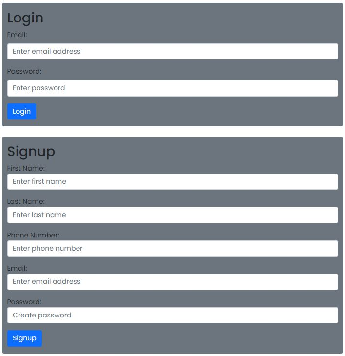
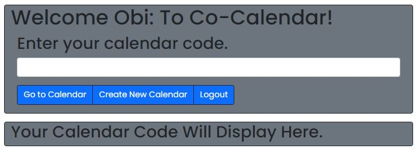
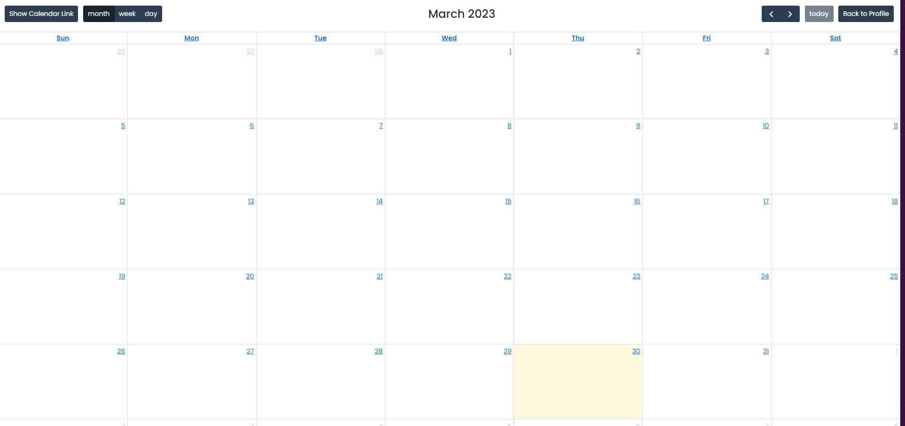
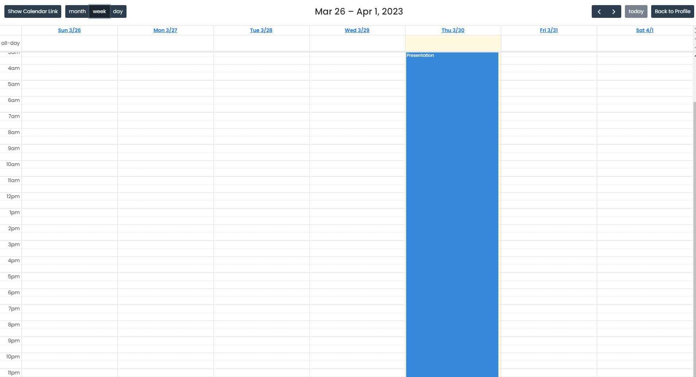
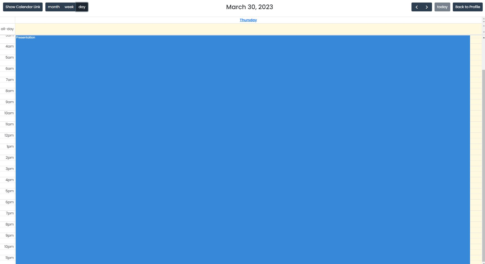

# Co-CALENDAR

## URL
https://chalcalendar.herokuapp.com/

## Description

This project is where friends/families can manage a public online calendar.
The user is prompted to signup and/or login.
The user is presented with a profile page with buttons to go to a calendar, create a calendar, and logout.
    Go to calendar button: Sends to calendar page
    Create a calendar button: Creates a calendar code
    Logout button: Logs user out and sends back to login/signup page
The user is presented with calendar page 
The user can add events, change from month, week, or day.
The user can be presented with calendar code and button to go back to the profile page.

## Summary

```
GIVEN a login page to login and signup
WHEN I am prompted to signup
THEN I can fill out signup form with name, phone number, email, and password
WHEN I am prompted login
THEN I can fill out login form with email and password
WHEN I login 
THEN I am presented buttons to go to calendar, create new calendar, and logout
WHEN I select the logout button
THEN I am logged out and sent back to login page
WHEN I create new calendar
THEN I prompt for a title to submit and presented with calendar code
WHEN I enter calendar code into search and hit go to calendar
THEN I am presented with the calendar page
WHEN I select a date 
THEN I can add en event for that date
WHEN I select the back to profile button
THEN I am presented with the profile page
WHEN I select the week and day button
THEN I am presented with a calendar of the week or day of events
WHEN I select the show calendar link button
THEN I am presented with the calendar code
```

## Installation

npm init -y
npm start

## Usage

This project is where friends/families can manage a public online calendar.











## Credits

N/A

## License

Please refer to the LICENSE in the repo.
